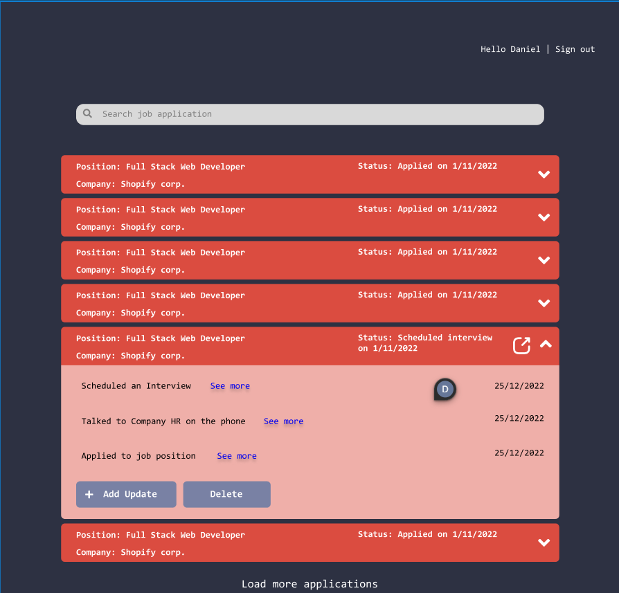
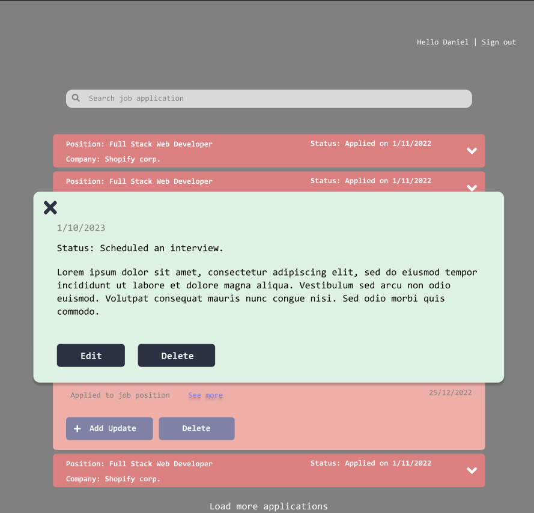
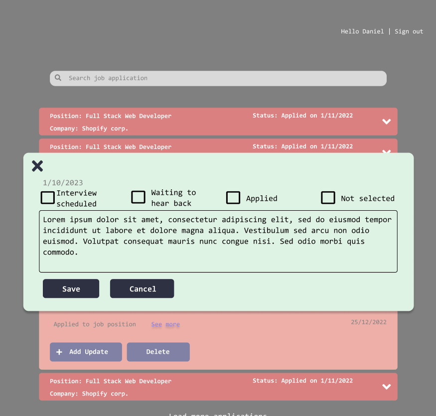

# JobSea
The goal of this application is to help people have an easier time keeping track of their job application.

Job hunting can get messy. Within a week, someone can have submitted over 50 applications. Where do you keep track of the jobs that stand out the most, or remind yourself of your stage in the hiring process with each prospective employment?

Instead of using spreadsheets or pen and paper, I decided to create a very easy-to-use single page application. My goal is to make it as easy to use as possible, while having enough features to accomplish its objective.

## Current Stage

The app is still in development. As a preview, here are some wireframes:

